## Laporan Praktikum Pemrograman Mobile Pertemuan 3 ##
## Pengenalan core Component dan Styling ###

## 🎯 Tujuan Pembelajaran
Setelah menyelesaikan praktikum ini, mahasiswa mampu:
1. Memahami dan menggunakan **16 Core Components** React Native
2. Menerapkan **StyleSheet** untuk styling terpusat
3. Menggunakan **useState** untuk state management dasar
4. Membuat layout yang responsif dengan **Flexbox**
5. Menangani **interaksi pengguna** (tekan, input, scroll)

Langkah 1: Mengimpor Components
1. buka file app.js pada folder projek ptmn3
2. import 16 core component sebagai berikut:
3. konfirmasi bukti

Langkah 2: Menyiapkan data Objek dan Array
1. membuat objek untuk menyimpan data Profile
2. Buat Objek Array bernama PROFILE
3. konfirmasi bukti 

4. Membuat Objek Array SKILLS untuk menyimpan data SKILLS 
5. Buat Objek Array bernama SKILLS
6. konfirmasi bukti

7. membuat objek array SECTIONS untuk menyimpan riwayat pekerjaan
8. membuat objek array SOSIAL untuk menyimpan media SOSIAL
9. konfirmasi bukti SECTIONS

10. konfirmasi bukti SOSIAL

Langkah 3: Sub-Components (SkillCard & TimelineCard)
1. Membuat komponen kecil untuk merender satu item list (component reuse).
2. Menambahkan kode SkillCard dan TimelineCard di antara data dan fungsi App().
3. Konfirmasi bukti
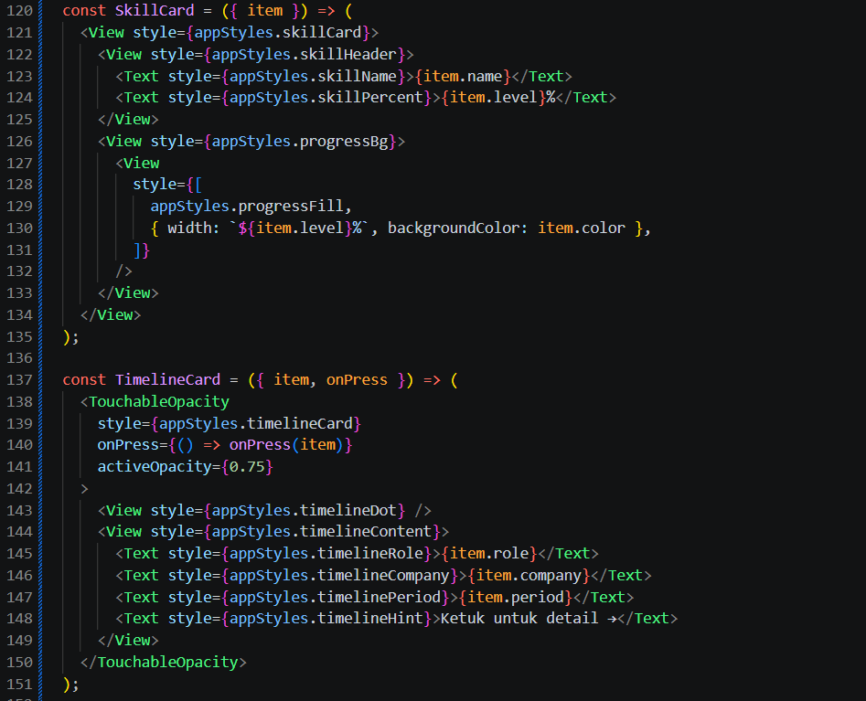

Langkah 4: State Management dengan useState
1. Menambahkan state management untuk menyimpan data yang bisa berubah.
2. Konfirmasi bukti
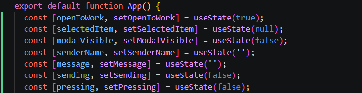

Langkah 5: SafeAreaView, StatusBar & Header
1. Mengatur SafeAreaView, StatusBar, dan header bar dengan Switch.
2. Konfirmasi bukti
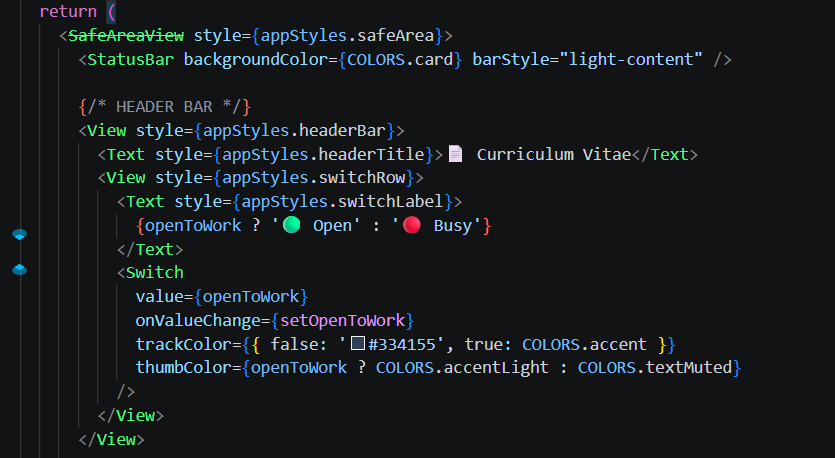

Langkah 6: ScrollView & Profil Section
1. Membungkus konten CV dengan ScrollView serta menampilkan foto profil dan data diri.
2. Konfirmasi bukti
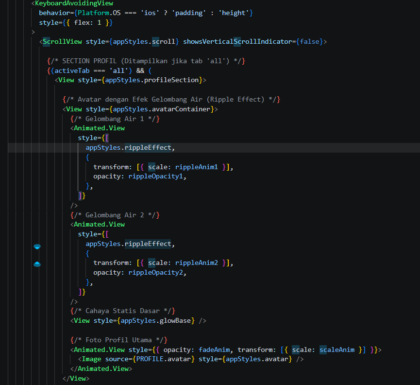

Langkah 7: FlatList (Daftar Skills)
1. Menambahkan komponen FlatList untuk menampilkan daftar skill secara efisien.
2. Konfirmasi bukti
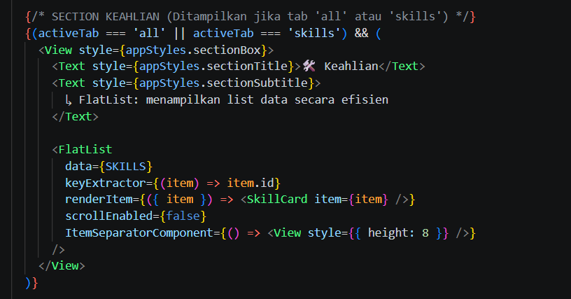

Langkah 8: SectionList (Pengalaman & Pendidikan)
1. Menambahkan SectionList untuk menampilkan riwayat pekerjaan dan pendidikan yang dikelompokkan.
2. Konfirmasi bukti
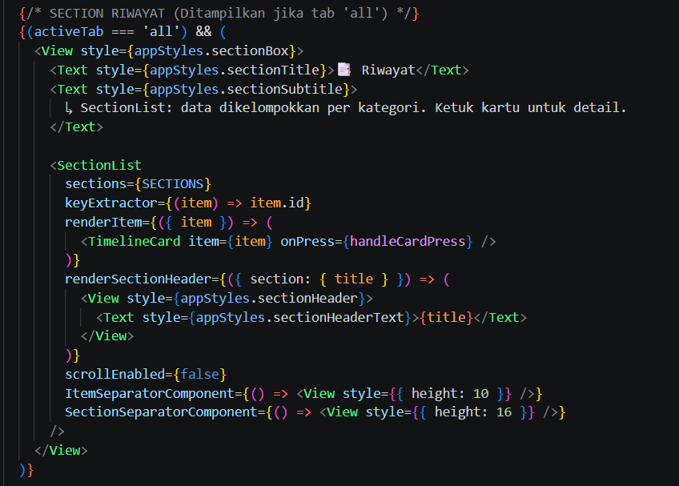

Langkah 9: TextInput, Button & ActivityIndicator
1. Membuat form kontak menggunakan TextInput, tombol kirim, dan indikator loading.
2. Konfirmasi bukti
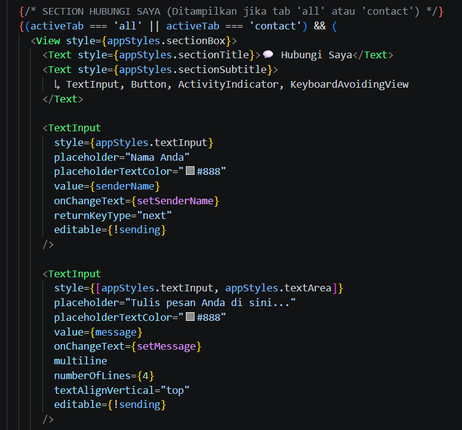

Langkah 10: Modal (Popup Detail)
1. Menambahkan komponen Modal untuk menampilkan detail riwayat saat kartu ditekan.
2. Konfirmasi bukti
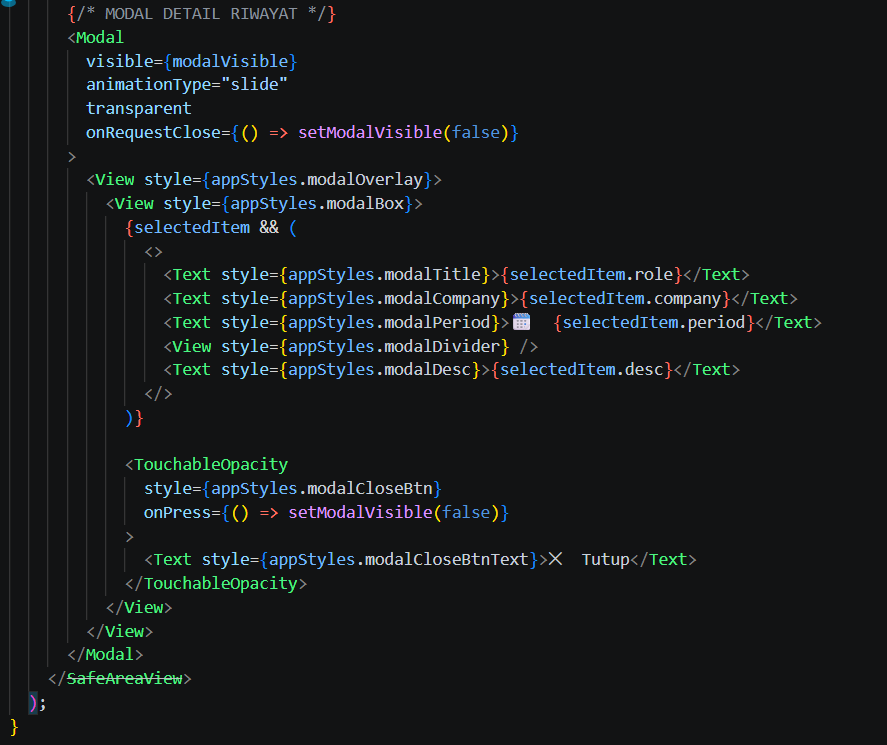

Langkah 11: StyleSheet (Styling Terpusat)
1. Menambahkan palet warna dan konfigurasi StyleSheet.create() di bagian bawah kode.
2. Konfirmasi bukti palet warna dan StyleSheet:
// ============================================
//  PALET WARNA (konstanta warna terpusat)
// ============================================
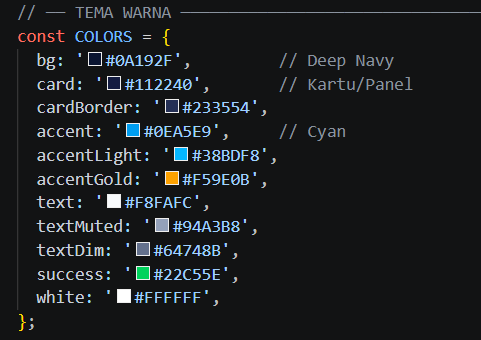

// ============================================
//  16. StyleSheet.create() → semua style
// ============================================
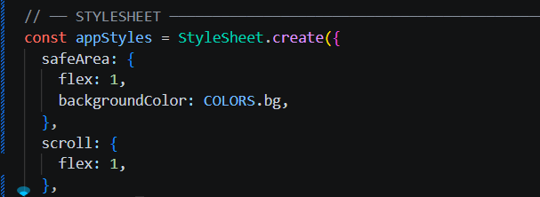

  // ── HEADER BAR ────────────────────────────
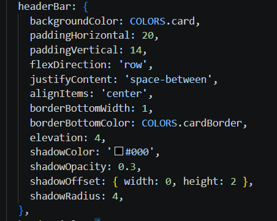

  // ── SECTION PROFIL ─────────────────────────
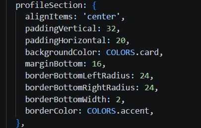

  // ── SOSIAL MEDIA ───────────────────────────
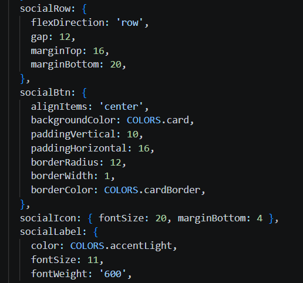

  // ── PRESSABLE DOWNLOAD ─────────────────────
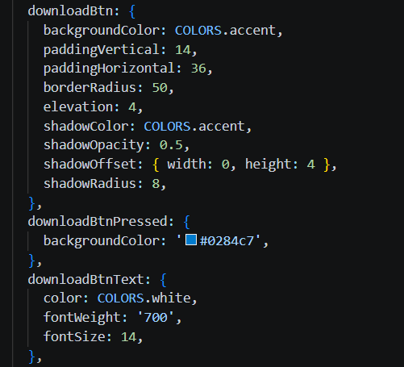

  // ── SECTION BOX (wrapper kartu) ────────────
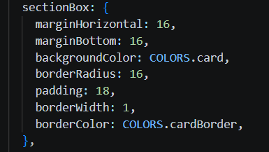

  // ── SECTION LIST HEADER ────────────────────
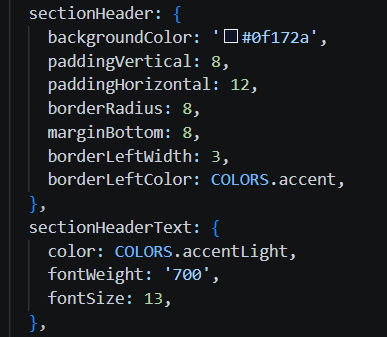

  // ── SKILL CARD ─────────────────────────────
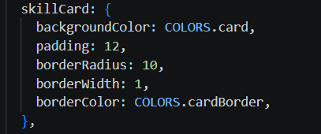

  // ── TIMELINE CARD ──────────────────────────
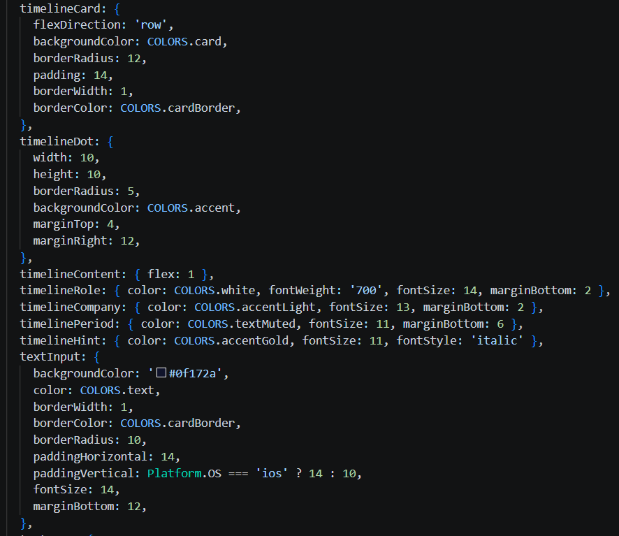

  // ── TEXT INPUT ─────────────────────────────
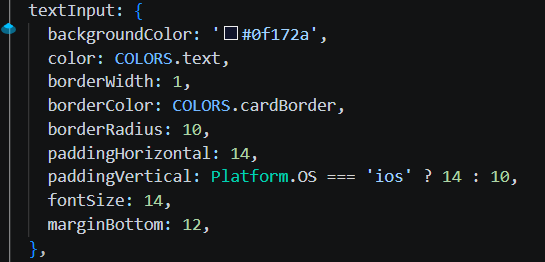

  // ── LOADING ROW ────────────────────────────
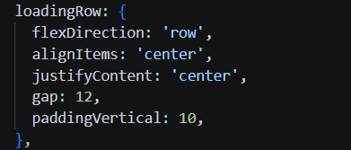

  // ── MODAL ──────────────────────────────────
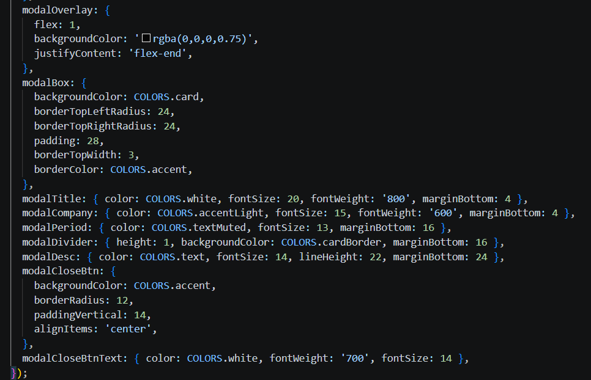

Langkah 12: Verifikasi & Pengujian
1. Melakukan pengujian seluruh fitur aplikasi sesuai tabel verifikasi di modul.
2. Konfirmasi hasil pengujian aplikasi berjalan dengan baik tanpa error.
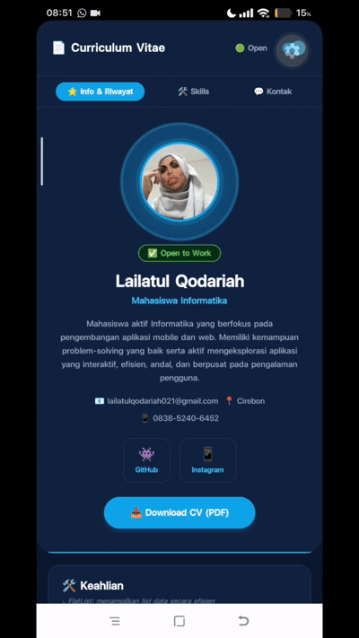

## 🏆 Tugas / Latihan
1. **Tugas Wajib:** Mengganti data profil dengan data pribadi, menambah 3 skill baru, serta menambah 1 pengalaman kerja dan 1 riwayat pendidikan baru.
2. **Tugas Pengembangan:** Menambahkan komponen pendukung dan improvisasi sesuai instruksi modul.