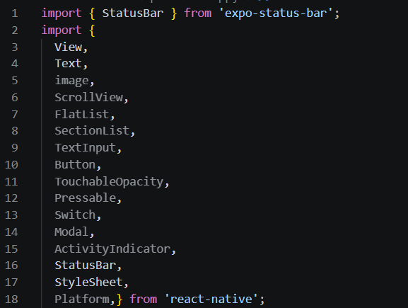
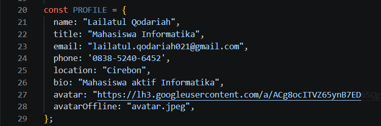
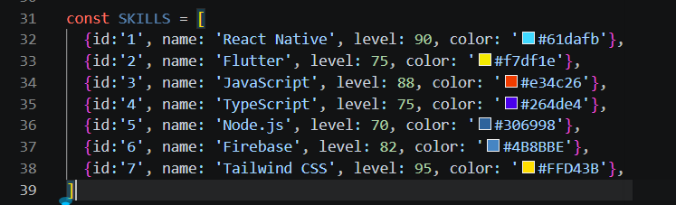
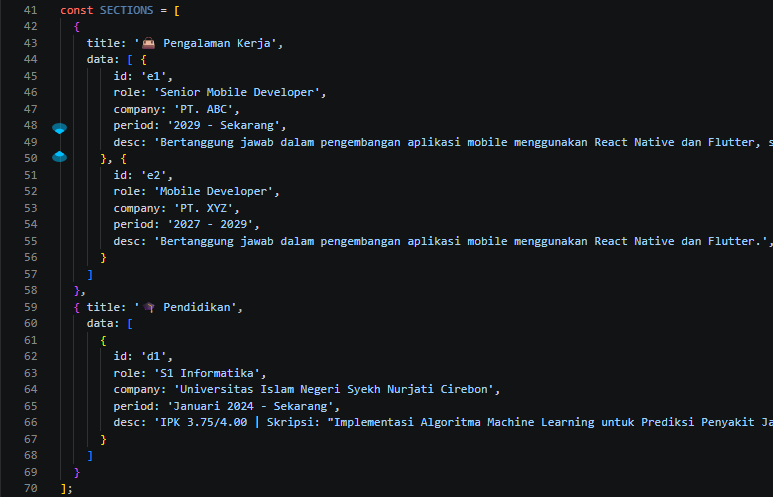
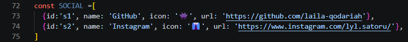

## Laporan Praktikum Pemrograman Mobile Pertemuan 3 ##
## Pengenalan core Component dan Styling ###

## 🎯 Tujuan Pembelajaran
Setelah menyelesaikan praktikum ini, mahasiswa mampu:
1. Memahami dan menggunakan **16 Core Components** React Native
2. Menerapkan **StyleSheet** untuk styling terpusat
3. Menggunakan **useState** untuk state management dasar
4. Membuat layout yang responsif dengan **Flexbox**
5. Menangani **interaksi pengguna** (tekan, input, scroll)

Langkah 1: Mengimpor Components
1. buka file app.js pada folder projek ptmn3
2. import 16 core component sebagai berikut:
3. konfirmasi bukti

Langkah 2: Menyiapkan data Objek dan Array
1. membuat objek untuk menyimpan data Profile
2. Buat Objek Array bernama PROFILE
3. konfirmasi bukti 

4. Membuat Objek Array SKILLS untuk menyimpan data SKILLS 
5. Buat Objek Array bernama SKILLS
6. konfirmasi bukti

7. membuat objek array SECTIONS untuk menyimpan riwayat pekerjaan
8. membuat objek array SOSIAL untuk menyimpan media SOSIAL
9. konfirmasi bukti SECTIONS

10. konfirmasi bukti SOSIAL
