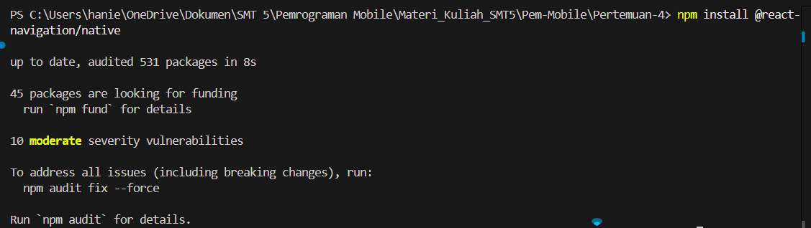
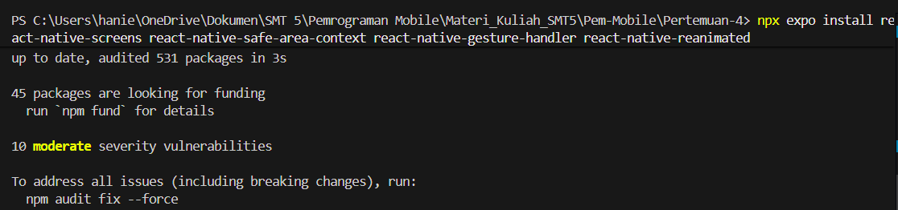
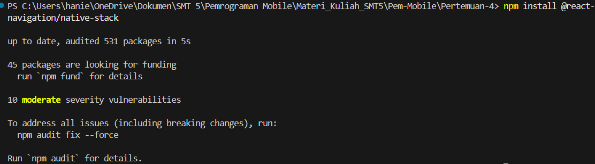
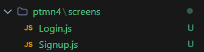
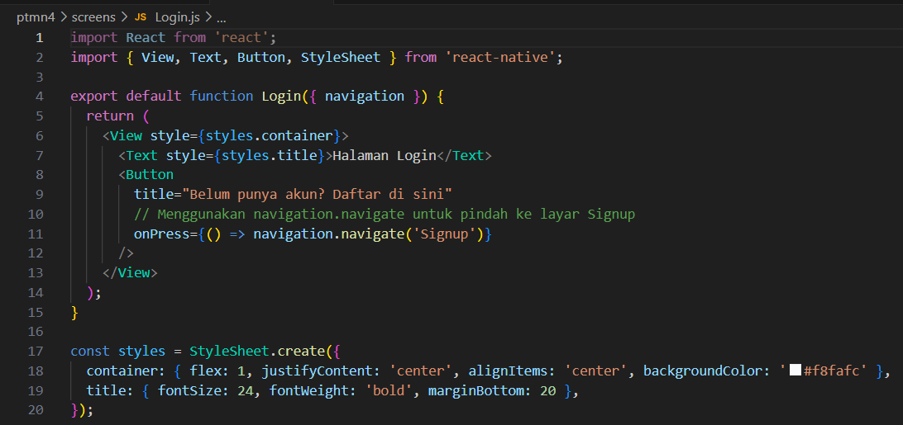
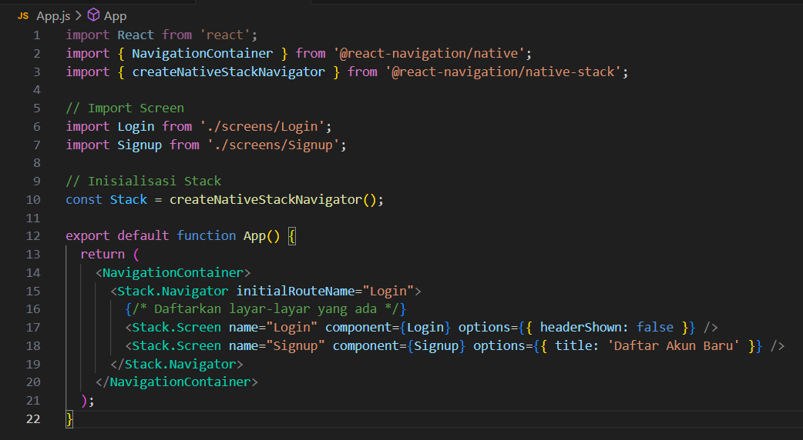

# MODUL PRAKTIKUM 4: Navigasi di React Native

1. Install (npm install @react-navigation/native)

2. Install (npx expo install react-native-screens react-native-safe-area-context react-native-gesture-handler react-native-reanimated)

## C. PRAKTIKUM 1: Stack Navigation
Langkah 1: Instalasi Pustaka Stack
Jalankan perintah berikut di terminal:
npm install @react-navigation/native-stack

Langkah 2: Membuat File Layar (Screens)
Buat dua file baru di dalam folder `screens`: `Login.js` dan `Signup.js`.

Login.js:

Signup.js

Langkah 3: Konfigurasi di `App.js`
Buka file `App.js` utama Anda dan integrasikan Stack Navigator:

Pengecekan: Jalankan aplikasi (`npx expo start`). Uji coba klik tombol untuk berpindah maju dan mundur antar layar.

## D. PRAKTIKUM 2: Drawer Navigation

## E. PRAKTIKUM 3: Bottom Tab Navigation

